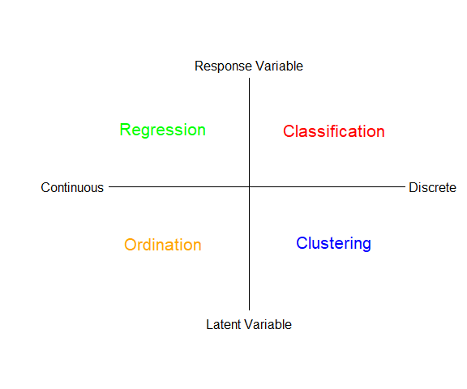
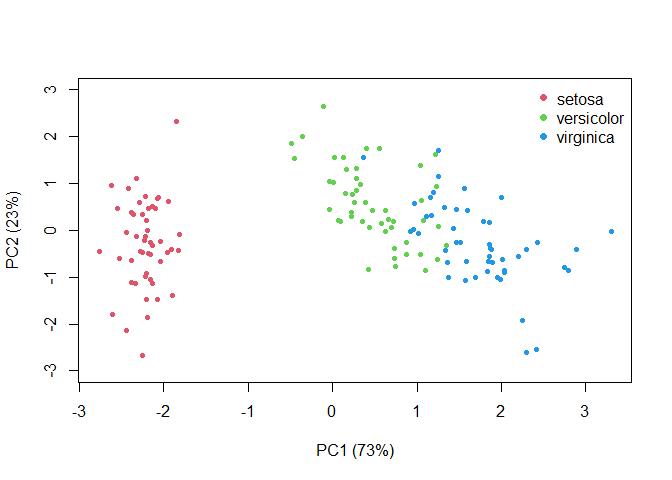
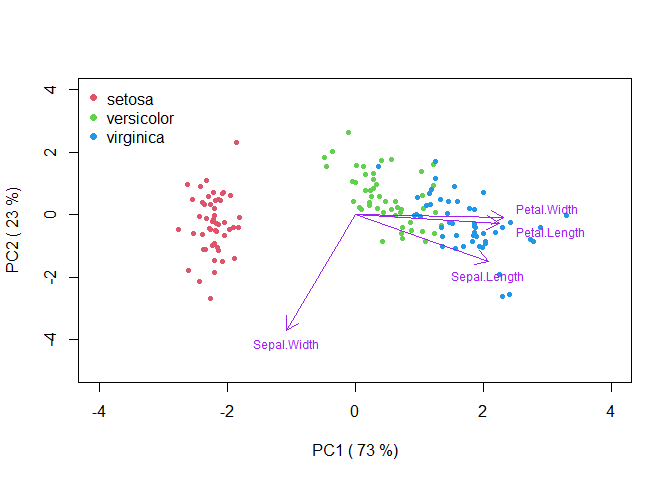

# Introduction to multivariate analysis

In this module we’ll be disccusing multivariate quantitative methods.
Analyses such as linear regression, where we relate a response, *y*, to
a predictor variable, *x*, are univariate techniques. If we have
multiple responses, *y*<sub>1</sub>...*y*<sub>*n*</sub>, and multiple
predictors, *x*<sub>1</sub>...*x*<sub>*n*</sub>, we need multivariate
approaches. For example, we may wish to understand how both
precipitation and soil type are related to plant community composition.
In this question, we may be tracking the abundance of over a dozen
different species and many different sites with different types of soil,
precipitation and other environmental factors. You can easily see that
this is not a situation that ordinary univariate approaches are designed
to handle!

There are many types of multivariate analysis, and in this module and
the next, we will only describe some of the most common ones. We can
think of these different types of analysis as laying at different ends
of a spectrum of treating the data as discrete vs continuous, and
relying on identifying a reponse variable *a priori* versus letting the
“data tell us” about explanatory features, i.e., latent variables (Fig.
@ref(fig:f1).

<br> <br>



<br>

## Multivariate resemblance

The starting point for a lot of the classic multivariate methods is to
find metrics that describe how similar two individuals, samples, sites
or species might be. A natural way to quantify similarity is to list
those characters that are shared. For example, what genetic or
morphological features are the same or different between two species? A
**resemblance measure** quantifies similarity by adding up in some way
the similarities and differences between two things. We can express the
shared characters of objects as either: **similarity (S)**, which
quantifies the degree of resemblance or **dissimilarity (D)** which
quantifies the degree of difference.

### Binary Similarity metrics

The simplest similarity metric just tallys the number of shared
features. This is called a binary similarity metric, since we are just
indicating a yes or no for each characteristic of the two things we wish
to compare (Table @ref(tab:t1)). <br>

<table style="width:65%;">
<caption>
List of shared attributes for two things
</caption>
<thead>
<tr>
<th style="text-align:center;">
Attribute
</th>
<th style="text-align:center;">
Object 1
</th>
<th style="text-align:center;">
Object 2
</th>
<th style="text-align:center;">
Similar
</th>
</tr>
</thead>
<tbody>
<tr>
<td style="text-align:center;">
Attribute 1
</td>
<td style="text-align:center;">
1
</td>
<td style="text-align:center;">
0
</td>
<td style="text-align:center;">
no
</td>
</tr>
<tr>
<td style="text-align:center;">
Attribute 2
</td>
<td style="text-align:center;">
0
</td>
<td style="text-align:center;">
1
</td>
<td style="text-align:center;">
no
</td>
</tr>
<tr>
<td style="text-align:center;">
Attribute 3
</td>
<td style="text-align:center;">
0
</td>
<td style="text-align:center;">
0
</td>
<td style="text-align:center;">
yes
</td>
</tr>
<tr>
<td style="text-align:center;">
Attribute 4
</td>
<td style="text-align:center;">
1
</td>
<td style="text-align:center;">
1
</td>
<td style="text-align:center;">
yes
</td>
</tr>
<tr>
<td style="text-align:center;">
Attribute 5
</td>
<td style="text-align:center;">
1
</td>
<td style="text-align:center;">
1
</td>
<td style="text-align:center;">
yes
</td>
</tr>
<tr>
<td style="text-align:center;">
Attribute 6
</td>
<td style="text-align:center;">
0
</td>
<td style="text-align:center;">
0
</td>
<td style="text-align:center;">
yes
</td>
</tr>
<tr>
<td style="text-align:center;">
Attribute 7
</td>
<td style="text-align:center;">
0
</td>
<td style="text-align:center;">
1
</td>
<td style="text-align:center;">
no
</td>
</tr>
<tr>
<td style="text-align:center;">
Attribute 8
</td>
<td style="text-align:center;">
0
</td>
<td style="text-align:center;">
0
</td>
<td style="text-align:center;">
yes
</td>
</tr>
<tr>
<td style="text-align:center;">
Attribute 9
</td>
<td style="text-align:center;">
1
</td>
<td style="text-align:center;">
1
</td>
<td style="text-align:center;">
yes
</td>
</tr>
<tr>
<td style="text-align:center;">
Attribute 10
</td>
<td style="text-align:center;">
1
</td>
<td style="text-align:center;">
0
</td>
<td style="text-align:center;">
no
</td>
</tr>
</tbody>
</table>

<br> We could also use a shared *lack* of features as an indicator of
similarity. The simple matching coefficient uses both shared features,
and shared absent features, to quantify similarity as
$S_m=\\frac{a+d}{a+b+c+d}$, where *a* refers to the number of shared
characteristics of object 1 and object 2, *b* is the number
characterisitics that object 1 possesses but object 2 does not and so on
(see Table @ref(tab:t2)). <br> <br>

<table style="width:90%; width: auto !important; " class="table table-bordered">
<caption>
Summary of shared and absent attributes
</caption>
<thead>
<tr>
<th style="empty-cells: hide;border-bottom:hidden;" colspan="1">
</th>
<th style="empty-cells: hide;border-bottom:hidden;" colspan="1">
</th>
<th style="border-bottom:hidden;padding-bottom:0; padding-left:3px;padding-right:3px;text-align: center; " colspan="1">

<div style="border-bottom: 1px solid #ddd; padding-bottom: 5px; ">

Object 1

</div>

</th>
<th style="border-bottom:hidden;padding-bottom:0; padding-left:3px;padding-right:3px;text-align: center; " colspan="1">

<div style="border-bottom: 1px solid #ddd; padding-bottom: 5px; ">

Object 2

</div>

</th>
</tr>
<tr>
<th style="text-align:center;">
</th>
<th style="text-align:center;">
</th>
<th style="text-align:center;">
Present
</th>
<th style="text-align:center;">
Absent
</th>
</tr>
</thead>
<tbody>
<tr>
<td style="text-align:center;font-weight: bold;">
Object 1
</td>
<td style="text-align:center;font-weight: bold;">
Present
</td>
<td style="text-align:center;">
a
</td>
<td style="text-align:center;">
b
</td>
</tr>
<tr>
<td style="text-align:center;font-weight: bold;">
Object 2
</td>
<td style="text-align:center;font-weight: bold;">
Absent
</td>
<td style="text-align:center;">
c
</td>
<td style="text-align:center;">
d
</td>
</tr>
</tbody>
</table>

We can further categorize similarity metrics as **symmetric**, where we
regard both shared presence and shared absence as evidence of
similarity, the simple matching coefficient, *S*<sub>*m*</sub> would be
an example of this, or **asymmetric**, where we regard only shared
presence as evidence of similarity (that is, we ignore shared absences).
Asymmetric measures are most useful in analyzing ecological community
data, since it is unlikely to be informative that two temperature zone
communities lack tropical data, or that aquatic environments lack
terrestrial species.

The Jaccard index is an asymmetric binary similarity coefficient
calculated as $S_J=\\frac{a}{a+b+c}$, while the quite similar Sørenson
index is given as $S_S=\\frac{2a}{2a+b+c}$, and so gives greater weight
to shared similarities. Both metrics range from 0 to 1, where a value of
1 indicates complete similarity. Notice that both metrics exclude cell
*d* - the shared absences.

Let’s try an example. In the 70s, Watson (1974) compared the zooplankton
species present in Lake Erie and Lake Ontario. We can use this
information to compare how similar the communities in the two lakes were
at this time. We can see that they shared a lot of species (Table
@ref(tab:t3))!

<table style="width:60%;">
<caption>
Species presence and absence in lake Erie and lake Ontario (data from
from Watson 1974)
</caption>
<thead>
<tr>
<th style="text-align:center;">
species
</th>
<th style="text-align:center;">
erie
</th>
<th style="text-align:center;">
ontario
</th>
</tr>
</thead>
<tbody>
<tr>
<td style="text-align:center;">
1
</td>
<td style="text-align:center;">
1
</td>
<td style="text-align:center;">
1
</td>
</tr>
<tr>
<td style="text-align:center;">
2
</td>
<td style="text-align:center;">
1
</td>
<td style="text-align:center;">
1
</td>
</tr>
<tr>
<td style="text-align:center;">
3
</td>
<td style="text-align:center;">
1
</td>
<td style="text-align:center;">
1
</td>
</tr>
<tr>
<td style="text-align:center;">
4
</td>
<td style="text-align:center;">
1
</td>
<td style="text-align:center;">
1
</td>
</tr>
<tr>
<td style="text-align:center;">
5
</td>
<td style="text-align:center;">
1
</td>
<td style="text-align:center;">
1
</td>
</tr>
<tr>
<td style="text-align:center;">
6
</td>
<td style="text-align:center;">
1
</td>
<td style="text-align:center;">
1
</td>
</tr>
<tr>
<td style="text-align:center;">
7
</td>
<td style="text-align:center;">
1
</td>
<td style="text-align:center;">
1
</td>
</tr>
<tr>
<td style="text-align:center;">
8
</td>
<td style="text-align:center;">
1
</td>
<td style="text-align:center;">
1
</td>
</tr>
<tr>
<td style="text-align:center;">
9
</td>
<td style="text-align:center;">
1
</td>
<td style="text-align:center;">
1
</td>
</tr>
<tr>
<td style="text-align:center;">
10
</td>
<td style="text-align:center;">
1
</td>
<td style="text-align:center;">
1
</td>
</tr>
<tr>
<td style="text-align:center;">
11
</td>
<td style="text-align:center;">
1
</td>
<td style="text-align:center;">
1
</td>
</tr>
<tr>
<td style="text-align:center;">
12
</td>
<td style="text-align:center;">
1
</td>
<td style="text-align:center;">
1
</td>
</tr>
<tr>
<td style="text-align:center;">
13
</td>
<td style="text-align:center;">
1
</td>
<td style="text-align:center;">
1
</td>
</tr>
<tr>
<td style="text-align:center;">
14
</td>
<td style="text-align:center;">
1
</td>
<td style="text-align:center;">
1
</td>
</tr>
<tr>
<td style="text-align:center;">
15
</td>
<td style="text-align:center;">
1
</td>
<td style="text-align:center;">
1
</td>
</tr>
<tr>
<td style="text-align:center;">
16
</td>
<td style="text-align:center;">
1
</td>
<td style="text-align:center;">
1
</td>
</tr>
<tr>
<td style="text-align:center;">
17
</td>
<td style="text-align:center;">
1
</td>
<td style="text-align:center;">
1
</td>
</tr>
<tr>
<td style="text-align:center;">
18
</td>
<td style="text-align:center;">
1
</td>
<td style="text-align:center;">
1
</td>
</tr>
<tr>
<td style="text-align:center;">
19
</td>
<td style="text-align:center;">
1
</td>
<td style="text-align:center;">
0
</td>
</tr>
<tr>
<td style="text-align:center;">
20
</td>
<td style="text-align:center;">
0
</td>
<td style="text-align:center;">
1
</td>
</tr>
<tr>
<td style="text-align:center;">
21
</td>
<td style="text-align:center;">
0
</td>
<td style="text-align:center;">
0
</td>
</tr>
<tr>
<td style="text-align:center;">
22
</td>
<td style="text-align:center;">
0
</td>
<td style="text-align:center;">
0
</td>
</tr>
<tr>
<td style="text-align:center;">
23
</td>
<td style="text-align:center;">
0
</td>
<td style="text-align:center;">
0
</td>
</tr>
<tr>
<td style="text-align:center;">
24
</td>
<td style="text-align:center;">
0
</td>
<td style="text-align:center;">
0
</td>
</tr>
</tbody>
</table>

<br>

We can calculate the similarity metrics quite easily using the
**table()** function, where 1 indicates presence and 0 indicates
absence. I have stored the information from Table @ref(tab:t3) in the
the dataframe *lksp*. I’m just going grab the presences and absences,
since I don’t need the species names for my calculation.

``` r
tlake = table(lksp[, c("erie", "ontario")])
tlake
```

        ontario
    erie  1  0
       1 18  1
       0  1  4

``` r
a = tlake[1, 1]
b = tlake[1, 2]
c = tlake[2, 1]
d = tlake[2, 2]

S_j = a/(a + b + c)
S_j
```

    [1] 0.9

``` r
S_s = 2 * a/(2 * a + b + c)
S_s
```

    [1] 0.9473684

A final note: when a dissimilarity or similarity metric has a finite
range, we can simply convert from one to the other. For example, for
similarities that range from 1 (identical) to 0 (completely different),
dissimilarity would simply be 1-similarity.

### Quantitative similarity & dissimilarity metrics

While binary similarity metrics are easy to understand, there are a few
problems. These metrics work best when we have a small number of
characteristics and we have sampled very well (e.g., the zooplankton in
Lake Erie and Ontario). However, these metrics are biased against
maximum similarity values when we have lots of charactersitics (or
species) and poor sampling.

In addition, we sometimes have more information than just a “yes” or
“no” which we could use to further characterize similarity. Quantiative
similarity and dissimilarity metrics make use of this information. Some
examples of quantitative similarity metrics are: Percentage similarity
(Renkonen index), Morisita’s index of similarity (not dispersion) and
Horn’s index. However, quantitative dissimilarity metrics are perhaps
more commonly used. In this case, we often talk about the “distance”
between two things. Distances are of two types, either dissimilarity,
converted from analogous similarity indices, or specific distance
measures, such as Euclidean distance, which doesn’t have a counterpart
in any similarity index. There are many, many such metrics, and
obviously, you should choose the most accurate and meaningful distance
measure for a given application. Legendre & Legendre (2012) offer a key
on how to select an appropriate measure for given data and problem
(check their Tables 7.4-7.6). If you are uncertain, then choose several
distance measures and compare the results.

**Euclidean Distance**

Perhaps the mostly commonly used, and easiest to understand,
dissimilarity, or distance, measure is Euclidian distance. This metric
is zero for identical sampling units and has no fixed upper bound.

Euclidean distance in multivariate space is derived from our
understanding of distance in a Cartesian plane. If we had two species
abundances measured in two different samples, we could then plot the
abundance of species 1 and species 2 for each sample on a 2D plane, and
draw a line between them. This would be our Euclidean distance: the
shortest path between the two points (Fig. @ref(fig:f2)).


We know that to calculate this distance we would just use the
Pythagorean theorem as $c=\\sqrt{a^2+b^2}$. To generalize to *n* species
we can say $D^E\_{jk}=\\sqrt{\\sum^n\_{i=1}(X\_{ij}-X\_{ik})^2}$, where
Euclidean distance between samples *j* and *k*,
*D*<sub>*j**k*</sub><sup>*E*</sup>, is calculated by summing over the
distance in abundance of each of n species in the two samples.

Let’s try an example. Given the species abundances in Table
@ref(tab:t4), we can calculate the squared difference in abundance for
each species, and sum that quantity.

<table style="width:65%;">
<caption>
Species abundance and distance calculations for two samples
</caption>
<thead>
<tr>
<th style="text-align:center;">
</th>
<th style="text-align:center;">
sample j
</th>
<th style="text-align:center;">
sample k
</th>
<th style="text-align:center;">
(*X*<sub>*j*</sub>−*X*<sub>*k*</sub>)<sup>2</sup>
</th>
</tr>
</thead>
<tbody>
<tr>
<td style="text-align:center;">
Species 1
</td>
<td style="text-align:center;">
19
</td>
<td style="text-align:center;">
35
</td>
<td style="text-align:center;">
256
</td>
</tr>
<tr>
<td style="text-align:center;">
Species 2
</td>
<td style="text-align:center;">
35
</td>
<td style="text-align:center;">
10
</td>
<td style="text-align:center;">
625
</td>
</tr>
<tr>
<td style="text-align:center;">
Species 3
</td>
<td style="text-align:center;">
0
</td>
<td style="text-align:center;">
0
</td>
<td style="text-align:center;">
0
</td>
</tr>
<tr>
<td style="text-align:center;">
Species 4
</td>
<td style="text-align:center;">
35
</td>
<td style="text-align:center;">
5
</td>
<td style="text-align:center;">
900
</td>
</tr>
<tr>
<td style="text-align:center;">
Species 5
</td>
<td style="text-align:center;">
10
</td>
<td style="text-align:center;">
50
</td>
<td style="text-align:center;">
1600
</td>
</tr>
<tr>
<td style="text-align:center;">
Species 6
</td>
<td style="text-align:center;">
0
</td>
<td style="text-align:center;">
0
</td>
<td style="text-align:center;">
0
</td>
</tr>
<tr>
<td style="text-align:center;">
Species 7
</td>
<td style="text-align:center;">
0
</td>
<td style="text-align:center;">
3
</td>
<td style="text-align:center;">
9
</td>
</tr>
<tr>
<td style="text-align:center;">
Species 8
</td>
<td style="text-align:center;">
0
</td>
<td style="text-align:center;">
0
</td>
<td style="text-align:center;">
0
</td>
</tr>
<tr>
<td style="text-align:center;">
Species 9
</td>
<td style="text-align:center;">
30
</td>
<td style="text-align:center;">
10
</td>
<td style="text-align:center;">
400
</td>
</tr>
<tr>
<td style="text-align:center;">
Species 10
</td>
<td style="text-align:center;">
2
</td>
<td style="text-align:center;">
0
</td>
<td style="text-align:center;">
4
</td>
</tr>
<tr>
<td style="text-align:center;">
TOTAL
</td>
<td style="text-align:center;">
131
</td>
<td style="text-align:center;">
113
</td>
<td style="text-align:center;">
3794
</td>
</tr>
</tbody>
</table>

Then all we need to do is to take the square root of the sum to obtain
the Euclidean distance. Did you get the correct answer of 61.6? Of
course, R makes this much easier, I can calculate Euclidean distance
using the **dist()** function, after creating a matrix of the two
columns of species abundance data from my original *eu* dataframe.

``` r
dist(rbind(j, k), method = "euclidean")
```

             j
    k 61.59545

There are many other quantitative dissimilarity metrics. For example,
Bray Curtis dissimilarity is frequently used by ecologists to quantify
differences between samples based on abundance or count data. This
measure is usually applied to raw abundance data, but can be applied to
relative abundances. It is calculated as:
$BC\_{ij}=1-\\frac{C\_{ij}}{S\_{i}+S\_{j}}$, where *C*<sub>*i**j*</sub>
is the sum over the smallest values for only those species in common
between both sites, *S*<sub>*i*</sub> and *S*<sub>*j*</sub> are the sum
of abundances at the two sites. This metric is directly related to the
Sørenson binary similarity metric, and ranges from 0 to 1, with 0
indicating complete similarity. This is not at distance metric, and so,
is not appropriate for some types of analysis.

### Comparing more than two communities/samples/sites/genes/species

What about the situation where we want to compare more than two
communities, species, samples or genes? We can simply generate a
dissimilarity or similarity **matrix**, where each pairwise comparison
is given. In the species composition matrix below (Table @ref(tab:t5)),
sample A and B do not share any species, while sample A and C share all
species but differ in abundances (e.g. species 3 = 1 in sample A and 8
in sample C). The calculation of Euclidean distance using the **dist()**
function produces a lower triangular matrix with the pairwise
comparisons (I’ve included the distance with the sample itself on the
diagonal).

You might notice that the Euclidean distance values suggest that A and B
are the most similar! Euclidean distance puts more weight on differences
in species abundances than on difference in species presences. As a
result, two samples not sharing any species could appear more similar
(with lower Euclidean distance) than two samples which share species
that largely differ in their abundances.

<table style="width:65%;">
<caption>
Species abundance versus species presence and Euclidean distance
</caption>
<thead>
<tr>
<th style="text-align:center;">
</th>
<th style="text-align:center;">
sample A
</th>
<th style="text-align:center;">
sample B
</th>
<th style="text-align:center;">
sample C
</th>
</tr>
</thead>
<tbody>
<tr>
<td style="text-align:center;">
species 1
</td>
<td style="text-align:center;">
0
</td>
<td style="text-align:center;">
1
</td>
<td style="text-align:center;">
0
</td>
</tr>
<tr>
<td style="text-align:center;">
species 2
</td>
<td style="text-align:center;">
1
</td>
<td style="text-align:center;">
0
</td>
<td style="text-align:center;">
4
</td>
</tr>
<tr>
<td style="text-align:center;">
species 3
</td>
<td style="text-align:center;">
1
</td>
<td style="text-align:center;">
0
</td>
<td style="text-align:center;">
8
</td>
</tr>
</tbody>
</table>

<br> <br>

``` r
dist(t(spmatrix), method = "euclidean", diag = TRUE)
```

             A        B        C
    A 0.000000                  
    B 1.732051 0.000000         
    C 7.615773 9.000000 0.000000

There are other disadvantages as well, and in general, there is simply
no perfect metric. For example, you may dislike the fact that Euclidean
distance also has no upper bound, and so it becomes difficult to
understand **how** similar two things are (i.e., the metric can only be
understood in a relative way when comparing many things, Sample A is
more similar to sample B than sample C, for example). You could use a
Bray-Curtis dissimilarity metric, which is quite easy to interpret, but
this metric will also confound differences in species presences and
differences in species counts (Greenacre 2017). The best policy is to be
aware of the advantages and disadvantages of the metrics you choose, and
interpret your analysis in light of this information.

### R functions

There are a number of functions in R that can be used to calculate
similarity and dissimilarity metrics. Since we are usually not just
comparing two objects, sites or samples, these functions can help make
your calculations much quicker when you are comparing many units.

**dist()** offers a number of quantitative distance measures
(e.g. euclidean,canberra and manhattan). The result is the distance
matrix which gives the dissimilarity of each pair of objects, sites or
samples. the matrix is an object of the class dist in R.

**vegdist()** (library vegan). The default distance used in this
function is Bray-Curtis distance, which is considered more suitable for
ecological data.

**dsvdis()** (library labdsv) Offers some other indices than vegdist
(e.g. ruzicka (or Růžička), a quantitative analogue of Jaccard, and
Roberts.

For full comparison of dist, vegdist and dsvdis,see
<http://ecology.msu.montana.edu/labdsv/R/labs/lab8/lab8.html>.

**dist.ldc()** (library adespatial) Includes 21 dissimilarity indices
described in Legendre & De Cáceres (2013), twelve of which are not
readily available in other packages. Note that Bray-Curtis dissimilarity
is called percentage difference (method = “percentdiff”).

**designdist()** (library vegan) Allows one to design virtually any
distance measure using the formula for their calculation.

**daisy()** (library cluster) Offers euclidean, manhattan and gower
distance.

**distance()** (library ecodist) Contains seven distance measures, but
the function is more for demonstration (for larger matrices, the
calculation takes rather long).

## Cluster Analysis

When we have a large number of things to compare, an examination of a
matrix of similarlity or dissimilatiry metrics can be tedious or even
impossible to do. One way to visualize the similarity among units is to
use some form of cluster analysis. Clustering is the grouping of data
objects into discrete similarity categories according to a defined
similarity or dissimilarity measure.

We can contrast clustering, which assumes that units (e.g., sites,
communities, species or genes) can be grouped into discrete categories
based on similarity, with ordination, which treats the similarity
between units as a continuous gradient (we’ll discuss ordination in
section @ref(Ord)). We can use clustering to do things like discern
whether there are one or two or three different communities in three or
four or five sampling units. It is used in many fields, such as machine
learning, data mining, pattern recognition, image analysis, genomics,
systems biology, etc. Machine learning typically regards data clustering
as a form of unsupervised learning, or from our figure above (Fig
@ref(fig:f1)), as a technique that uses “latent” variables because we
are not guided by *a priori* ideas of which variables or samples belong
in which clusters.

### Hierarchical clustering: groups are nested within other groups.

Perhaps the most familiar type of clustering is hierarchical. There are
two kinds: **divisive** and **agglomerative**. In the divisive method,
the entire set of units is divided into smaller and smaller groups. The
agglomerative method starts with small groups of few units, and groups
them into larger and larger clusters, until the entire data set is
sampled (Pielou, 1984). Of course, once you have more than two units,
you need some way to assess similarity between the clusters. There are a
couple of different methods here. Single linkage assigns the similarity
between clusters to the most similar units in each cluster. Complete
linkage uses the similarity between the most dissimilar units in each
cluster, while average linkage averages over all the units in each
cluster (Fig. @ref(fig:f6)).


**Single Linkage Cluster Analysis**

Single linkage cluster analysis is one of the easiest to explain. It is
hierarchical, agglomerative technique. We start by creating a matrix of
similarity (or dissimilarity) indices between the units we want to
compare.

Then we find the most similar pair of samples, and that will form the
1st cluster. Next, we find either: (a) the second most similar pair of
samples or (b) highest similarity between a cluster and a sample, or (c)
most similar pair of clusters, whichever is greatest. We then continue
this process until until there is one big cluster. Remember that in
single linkage, similarity between two clusters = similarity between the
two nearest members of the clusters. Or if we are comparing a sample to
a cluster, the similarity is defined as the similarity between sample
and the nearest member of the cluster.

Let’s try this with simulated data where we have 5 data units (e.g.,
sites, species, genes), that each have 5 different quantitative
characters (e.g., number of individuals of a given species,
morphological features, functions).

``` r
cls = data.frame(a = c(5, 6, 34, 1, 12), b = c(10, 5, 2, 3, 4),
    c = c(10, 59, 32, 3, 40), d = c(2, 63, 10, 29, 45), e = c(44,
        35, 40, 12, 20))
clsd = dist(t(cls), method = "euclidean")
round(clsd, 0)
```

       a  b  c  d
    b 33         
    c 60 71      
    d 76 76 36   
    e 51 62 48 66

We can see that we construct the cluster diagram by first grouping a and
b, followed by c & d, and so on (Fig. @ref(fig:clust5)).


### How many clusters?

These hierarchical methods just keep going until all objects are
included (agglomerative methods), or are each in their own group
(divisive methods). However, neither endpoint is very useful. How do we
select the number of groups? There are metrics and techniques to make
this decision more objective (see the [NbClust
package](https://www.jstatsoft.org/article/view/v061i06). In this brief
introduction, we’ll just mention that for hierarchical methods, you can
determine the number of groups a given degree of similarity, or set the
number of groups and find the degree of similarity that results in that
number of groups. Let’s try. We’ll use the **cutree()** function that
works on cluster diagrams produced by the **hclust()** function (Fig.
@ref(fig:hclustfig)).

If we set our dissimilarity threshold at 40, we find that there are
three groups: a&b, c&d, and e in its own group.


    a b c d e 
    1 1 2 2 3 

### Partitional clustering and Fuzzy clustering

There are other means of clustering data of course. Partitional
clustering is the division of data objects into non-overlapping subsets,
such that each data object is in exactly one subset. In one version of
this, **k-means clustering**, each cluster is associated with a centroid
(center point), and each data object is assigned to the cluster with the
closest centroid. In this method, the number of clusters, K, must be
specified in advance. Our method is:

1.  Choose the number of K clusters
2.  Select K points as the initial centroids
3.  Calculate the distance of all items to the K centroids
4.  Assign items to closest centroid
5.  Recompute the centroid of each cluster
6.  Repeat from (3) until clusters assignments are stable

K-means has problems when clusters are of differing sizes and densities,
or are non-globular shapes. It is also very sensitive to outliers.

In contrast to strict (or hard) clustering approaches, fuzzy (or soft)
clustering methods allow multiple cluster memberships of the clustered
items. **Fuzzy clustering** is commonly achieved by assigning to each
item a weight of belonging to each cluster. Thus, items at the edge of a
cluster may be in a cluster to a lesser degree than items at the center
of a cluster. Typically, each item has as many coefficients (weights) as
there are clusters that sum up for each item to one.

### R functions for clustering

**hclust()** calculates hierarchical, agglomerative clusters and has
it’s own plot function.

**agnes()** (library cluster) Contains six agglomerative algorithms,
some not included in hclust.

**diana()** divisive hierarchical clustering

**kmeans()** - kmeans clustering

**fanny()**(cluster package) - fuzzy clustering

### Exercise: Cluster analysis of isotope data

Let’s try some of these methods on some ecological data. Try to work
through the exercise semi-independently. Our first step is to download
and import the dataset “Dataset_S1.csv” from Perkins et al. 2014 (see
url below). This data contains δ15N and δ13C signatures for species from
different food webs. Unfortunately, this data is saved in an .xlsx file.

To read data into R one of the easiest options is to use the read.csv()
function with the argument on a .csv file. These **C**omma **S**eparated
**F**iles are one of your best options for reproducible research. They
are human readable and easily handled by almost every type of software.
In contrast Microsoft Excel uses a propriatory file format, is not fully
backwards compatible, and although widely used, is not human readable.
As a result, we need special tools to access this file outside of
Microsoft software products

We’ll download the data set using **download.file()**, and read it using
the R library *openxlsx* (see example below).Once you have successfully
read your data file into R, take a look at it! Type *iso* (or whatever
you named your data object) to see if the data file was read in
properly. Some datasets will be too large for this approach to be useful
(the data will scroll right off the page). In that case, there are a
number of commands to look at a portion of the dataset. For example, you
could use a command like *names(iso)* or *str(iso)*.

One of the best things to do is plot the imported data. Of course, this
is not always possible with very large datasets, but this set should
work.

``` r
library(openxlsx)
urlj = "https://doi.org/10.1371/journal.pone.0093281.s001"
download.file(urlj, "p.xlsx", mode = "wb")
iso = read.xlsx("p.xlsx")
```

``` r
plot(iso$N ~ iso$C, col = as.numeric(as.factor(iso$Food.Chain)),
    xlim = c(-35, 0), pch = as.numeric(as.factor(iso$Species)),
    xlab = "d13C", ylab = "d15N")

legend("topright", legend = unique(as.factor(iso$Food.Chain)),
    pch = 1, col = as.numeric(unique(as.factor(iso$Food.Chain))),
    bty = "n", title = "Food chain")

legend("bottomright", legend = as.character(unique(as.factor(iso$Species))),
    pch = as.numeric(unique(as.factor(iso$Species))), bty = "n")
```


We are going to use this data set to see if a cluster analysis on δ15N
and δ13C can identify the foodweb. That is we are going to see if the
latent variables identified by our clustering method match up to what we
think we know about the data. Our first step is to create a
dissimilarity matrix, but even before this, we must select that part of
the data that we wish to use, just the δ15N and δ13C data, not the other
components of the dataframe for the downloaded data.

In addition, our analysis will be affected by the missing data. So let’s
get remove those rows with missing data right now using the
**complete.cases()** function. The function returns a value of TRUE for
every row in a dataframe that no missing values in any column. So
niso=iso\[complete.cases(mydata),\], will be a new data frame with only
complete row entries.

The function **dist()** will generate a matrix of the pairwise Euclidean
distances between pairs of observations. Now that you have a
dissimilarity matrix, you can complete a cluster analysis. The function
**hclust()** will produce a data frame that can be sent to the plot()
function to visualize the recommended clustering. The method used to
complete the analysis is indicated below the graph. Please adjust the
arguments of the function to complete a single linkage analysis (look at
?hclust to determine the method to do this).

``` r
str(iso)
```

    'data.frame':   165 obs. of  7 variables:
     $ Replicate      : num  1 2 3 4 5 6 7 8 9 10 ...
     $ Food.Chain     : chr  "Wheat" "Wheat" "Wheat" "Wheat" ...
     $ Species        : chr  "Plant" "Plant" "Plant" "Plant" ...
     $ Tissue         : chr  "Leaf" "Leaf" "Leaf" "Leaf" ...
     $ Lipid.Extracted: chr  "No" "No" "No" "No" ...
     $ C              : num  -30.1 -31.7 -30.1 -30.9 -31 ...
     $ N              : num  -3.47 -2.68 3.42 1.27 6.2 ...

``` r
diso <- dist((iso[, c("C", "N")]), method = "euclidean")
p = hclust(diso, method = "single")
plot(p, cex = 0.5, main = "")
```


When you graph your cluster using plot(), you notice that there are many
individual measurements, but there are only a few large groups. Does it
look like there is an outlier? If so, you may want to remove this point
from the data set, and then rerun the analysis. The row numbers are used
as labels by default, so this is easy to do (niso=niso\[-5,\]).

When you examine the data set, you noted that there are 4 Food.chain
designations. We will use the cutree() function to cut our cluster tree
to get the desired number of groups (4), and then save the group numbers
to a new column in our original dataframe. For example, iso$clust\<-
cutree(p,4).We can then plot the data using colours and symbols to see
how well our

``` r
niso = iso[complete.cases(iso), ]
niso = niso[-5, ]
diso <- dist((niso[, c("C", "N")]), method = "euclidean")
p = hclust(diso, method = "single")
niso$clust <- cutree(p, k = 4)

# plotting the data with 4 groups identified by the
# single-linkage cluster analysis superimposed
plot(niso$N ~ niso$C, col = as.numeric(as.factor(niso$clust)),
    xlim = c(-35, 0), pch = as.numeric(as.factor(niso$Species)),
    xlab = "d13C", ylab = "d15N")

legend("topright", legend = unique(as.factor(niso$clust)), pch = 1,
    col = as.numeric(unique(as.factor(niso$clust))), bty = "n",
    title = "cluster")

legend("bottomright", legend = as.character(unique(as.factor(niso$Species))),
    pch = as.numeric(unique(as.factor(niso$Species))), bty = "n",
    title = "Species")
```


It doesn’t look like our cluster algorithm is matching up with our
Food.chain data categories very well. Wheat- and Nettle-based food
chains cannot be distinguished, which makes sense when you consider that
both of these plants are terrestrial and use a C3 photosynthesis system.
If you are not happy with the success of this clustering algorithm you
could try other variants (e.g., “complete” linkage) and a different
number of groups.

Let’s try a non-hierarchical cluster analysis on the same data to see if
it works better. The **kmeans()** function requires that we select the
required number of clusters ahead of time (we want 4, so
kclust=kmeans(niso\[,c(“C”, “N”)\], 4)), we can then save the assigned
clusters to our dataframe and plot in a similar way  It
looks like kmeans has the same problem with distinguishing C3
plant-based foodwebs. But we still get three groups that roughly map
onto our information about the data. Were you able to produce the same
graph?

## Ordination

While cluster analysis let’s us visualize multivariate data by grouping
objects into discrete categories, ordination uses continuous axes to
help us accomplish the same task. Physicists grumble if space exceeds
four dimensions, while biologists typically grapple with dozens of
dimensions. We can “order” this multivariate data in order to produce a
low dimensional picture (i.e., a graph in 1-3 dimensions). Just like
cluster analysis, we will use similarity metrics to accomplish this.
Also like cluster anlaysis, simple ordination is not a statistical test:
it is a method of visualizing data.

Essentially, we find axes in the data that explain a lot of variation,
and rotate so we can use the axes as our dimensions of visual
representation (Fig. @ref(fig:dummy1)).


Another way to think about it is that we are going to summarize the raw
data, which has many variables, *p*, by a smaller set of synthetic
variables, *k* (Fig. @ref(fig:dimred)). If the ordination is
informative, it reduces a large number of original correlated variables
to a small number of new uncorrelated variables. But it really is a bit
of a balancing act between clarity of representation, ease of
understanding, and oversimplification. We will lose information in this
data reduction, and if that information is important, then we can make
the multivariate data harder to understand! Also note that if the
original variables are not correlated, then we won’t gain anything with
ordination.


There are lots of different ways to perform an ordination, but most
methods are based on extracting the eigenvalues of a similarity matrix.
The four most commonly used methods are: *Principle Component Analysis
(PCA)*, which is the main eigenvector-based method, *Correspondence
Analysis (CA)* which is used used on frequency data, *Principle
Coordinate Analysis (PCoA)* which works on dissimilarity matrices, and
*Non Metric Multidimensional Scaling (nMDS)* which is not an eigenvector
method, instead it represents objects along a predetermined number of
axes. Legendre & Legendre (2012) provide a nice summary of when you
should use each method (Table @ref(tab:tord)).

<table>
<caption>
Domains of application of ordination methods (adapated from Legendre &
Legendre 2012)
</caption>
<thead>
<tr>
<th style="text-align:left;">
Method
</th>
<th style="text-align:left;">
Distance
</th>
<th style="text-align:left;">
Variables
</th>
</tr>
</thead>
<tbody>
<tr>
<td style="text-align:left;">
Principal component analysis (PCA)
</td>
<td style="text-align:left;">
Euclidean
</td>
<td style="text-align:left;">
Quantitative data, but not species community data
</td>
</tr>
<tr>
<td style="text-align:left;">
Correspondence analysis (CA)
</td>
<td style="text-align:left;">
X^2
</td>
<td style="text-align:left;">
Non-negative, quantitiative or binary data (e.g., species frequencies or
presence/absence data)
</td>
</tr>
<tr>
<td style="text-align:left;">
Principal coordinate analysis (PCoA), metric (multidimensional) scaling,
classical scaling
</td>
<td style="text-align:left;">
Any
</td>
<td style="text-align:left;">
Quantitative, semiquantitative, qualitative, or mixed data
</td>
</tr>
<tr>
<td style="text-align:left;">
Nonmetric multidimensional scaling (nMDS)
</td>
<td style="text-align:left;">
Any
</td>
<td style="text-align:left;">
Quantitative, semiquantitative, qualitative, or mixed data
</td>
</tr>
</tbody>
</table>

### Principal Components Analysis (PCA)

**P**rincipal **C**omponents **A**nalysis is probably the most
widely-used and well-known of the standard multivariate methods. It was
invented by Pearson (1901) and Hotelling (1933), and first applied in
ecology by Goodall (1954) under the name “factor analysis” (NB
“principal factor analysis” is also a synonym of PCA). Like most
ordination methods, PCA takes a data matrix of *n* objects by *p*
variables, which may be correlated, and summarizes it by uncorrelated
axes (principal components or principal axes) that are linear
combinations of the original *p* variables. The first *k* components
display as much as possible of the variation among objects. PCA uses
Euclidean distance calculated from the *p* variables as the measure of
dissimilarity among the *n* objects, and derives the best possible
k-dimensional representation of the Euclidean distances among objects,
where *k* \< *p* .

We can think about this spatially. Objects are represented as a cloud of
n points in a multidimensional space with an axis for each of the p
variables. So the centroid of the points is defined by the mean of each
variable, and the variance of each variable is the average squared
deviation of its n values around the mean of that variable (i.e.,
$V_i= \\frac{1}{n-1}\\sum\_{m=1}^{n}{(X\_{im}-\\bar{X_i)}^2}$). The
degree to which the variables are linearly correlated is given by their
covariances
$C\_{ij}=\\frac{1}{n-1}\\sum\_{m=1}^n{(X\_{im}-\\bar{X_i})(X\_{jm}-\\bar{X_j})}$.
The objective of PCA is to rigidly rotate the axes of the p-dimenional
space to new positions (principal axes) that have the following
properties: they are ordered such that principal axis 1 (or the
*principal component* has the highest variance, axis 2 has the next
highest variance etc, and the covariance among each pair of principal
axes is zero (the principal axes are uncorrelated) (Fig.
@ref(fig:varord)).


So our steps are to compute the variance-covariance matrix of the data,
calculate the eigenvalues of this matrix and then calculate the
associated eigenvectors. Then, the jth eigenvalue is the variance of the
jth principle component and the sum of all the eigenvalues is the total
variance explained. The proportion of variance explained by each
component, or synthetic axis, is the eigenvalue for the component
divided by the total variance explained, while the rotations are the
eigenvectors. Dimensionality reduction is the same as first rotating the
data with the eigenvalues to be aligned with the principle components,
then display using only the components with the greatest eigenvalues.

### Exercise: PCA on the iris data

We’re going to use a sample dataset in R and the base R version of PCA
to start exploring this data analysis technique. Get the iris dataset
into memory by typing “data(“iris”). Take a look at this dataset using
the **head()**, **str()** or **summary()** functions. For a multivariate
data set, you would like to take a look at the pairwise correlations.
Remember that PCA can’t help us if the variables are not correlated.
Let’s use the **pairs()** function to do this

``` r
data("iris")
str(iris)
```

    'data.frame':   150 obs. of  5 variables:
     $ Sepal.Length: num  5.1 4.9 4.7 4.6 5 5.4 4.6 5 4.4 4.9 ...
     $ Sepal.Width : num  3.5 3 3.2 3.1 3.6 3.9 3.4 3.4 2.9 3.1 ...
     $ Petal.Length: num  1.4 1.4 1.3 1.5 1.4 1.7 1.4 1.5 1.4 1.5 ...
     $ Petal.Width : num  0.2 0.2 0.2 0.2 0.2 0.4 0.3 0.2 0.2 0.1 ...
     $ Species     : Factor w/ 3 levels "setosa","versicolor",..: 1 1 1 1 1 1 1 1 1 1 ...

``` r
summary(iris[1:4])
```

      Sepal.Length    Sepal.Width     Petal.Length    Petal.Width   
     Min.   :4.300   Min.   :2.000   Min.   :1.000   Min.   :0.100  
     1st Qu.:5.100   1st Qu.:2.800   1st Qu.:1.600   1st Qu.:0.300  
     Median :5.800   Median :3.000   Median :4.350   Median :1.300  
     Mean   :5.843   Mean   :3.057   Mean   :3.758   Mean   :1.199  
     3rd Qu.:6.400   3rd Qu.:3.300   3rd Qu.:5.100   3rd Qu.:1.800  
     Max.   :7.900   Max.   :4.400   Max.   :6.900   Max.   :2.500  

``` r
pairs(iris[1:4], main = "Iris Data", pch = 19, col = as.numeric(iris$Species) +
    1)
```


The colours let us see the data for each species, the graph is all the
pairwise plots of each pair of the 4 variables (Fig. @ref(fig:coriris)).
Do you see any correlations?

If there seem to be some correlations we might use PCA to reduce the 4
dimensional variable space to 2 or 3 dimensions. Let’s rush right in and
use the **prcomp()** function to run a PCA on the numerical data in the
iris dataframe. Save the output from the function to a new variable name
so you can look at it when you type that name. The **str()** function
will show you what the output object includes. If you use the
**summary()** function, R will tell you what proportion of the total
variance is explained by each axis.

``` r
pca <- prcomp(iris[, 1:4])
summary(pca)
```

    Importance of components:
                              PC1     PC2    PC3     PC4
    Standard deviation     2.0563 0.49262 0.2797 0.15439
    Proportion of Variance 0.9246 0.05307 0.0171 0.00521
    Cumulative Proportion  0.9246 0.97769 0.9948 1.00000

#### Standardize your data

There is a problem though, let’s examine the variance in the raw data.
Use the **apply()** function to quickly calculate the variance in each
of the numeric columns of the data as apply(iris\[,1:3\], 1, var). What
do you see? Are the variances of each the columns comparable?

``` r
apply(iris[, 1:4], 2, var)
```

    Sepal.Length  Sepal.Width Petal.Length  Petal.Width 
       0.6856935    0.1899794    3.1162779    0.5810063 

Using covariances among variables only makes sense if they are measured
in the same units, and even then, variables with high variances will
dominate the principal components. These problems are generally avoided
by standardizing each variable to unit variance and zero mean as
$X\_{im}^{'}=\\frac{x\_{im}-\\bar{X_i}}{sd_i}$ where sd is the standard
deviation of variable *i*. After standardizaton, the variance of each
variable is 1 and the covariances of the standardized variables are
correlations.

If you look at the help menu, the notes for the use of prcomp() STRONGLY
recommend standardizing the data. To do this there is a built in option.
We just need to set scale=TRUE. Let’s try again with data
standardization. Save your new PCA output to a different name. Take a
look at the summary.

``` r
p <- prcomp(iris[, 1:4], scale = TRUE)
summary(p)
```

    Importance of components:
                              PC1    PC2     PC3     PC4
    Standard deviation     1.7084 0.9560 0.38309 0.14393
    Proportion of Variance 0.7296 0.2285 0.03669 0.00518
    Cumulative Proportion  0.7296 0.9581 0.99482 1.00000

We now have less variance explained by axis 1. This makes sense,
because, as we will see in a moment, axis 1 is strongly influenced by
petal length, but in the unstandardized data, petal length had larger
variance than anything else.

#### Choose your axes

Now we need to determine how many axes to use to interpret our analysis.
For 4 variables it is easy enough to just look that the amount of
variance, as we just did. For larger numbers of variables a plot can be
useful. The **screeplot()** function will output the variance explained
by each of the principle component axes, and you can make a decision
based on that (e.g., screeplot(pca2, type=“lines”)).

An ideal curve should be steep, then bend at an “elbow” — this is your
cutting-off point — and after that flattens out. To deal with a
not-so-ideal scree plot curve you can apply the Kaiser rule: pick PCs
with eigenvalues of at least 1. Or you can select using the proportion
of variance where the PCs should be able to describe at least 80% of the
variance.


It looks like synthetic axes 1 & 2 explain most of the variation. This
is, of course, always true, but in this case only a very small
proportion of the variance is explanaed by axes 3 & 4, so we don’t need
to consider them any further. So let’s plot those out.

#### Plot your ordination

A PCA plot displays our samples in terms of their position (or
**scores**) on the new axes. We can add information about how much
variation each axis explains, and colour our points to match species
identity. In this 2D representation of 4 dimensional space, it looks
like species *I. versicolor* and *I. viriginica* are the most similar
(Fig. @ref(fig:pacfirst)).

``` r
pvar = round(summary(p)$importance[2, 1:2], 2)

plot(p$x[, 1:2], col = as.numeric(iris$Species) + 1, ylim = c(-3,
    3), cex = 0.7, pch = 16, xlab = paste0("PC1 (", pvar[1] *
    100, "%)"), ylab = paste0("PC2 (", pvar[2] * 100, "%)"))
legend("topright", legend = unique(iris$Species), pch = 16, col = c(2,
    3, 4), bty = "n")
```



We can also plot information about influence the various characteristics
are having on each of the axes. The eigenvectors used for the rotation
give us this information. So let’s just print that out.

<table style="width:50%;">
<caption>
Eigenvectors for each variable and synthetic axis
</caption>
<thead>
<tr>
<th style="text-align:left;">
</th>
<th style="text-align:center;">
PC1
</th>
<th style="text-align:center;">
PC2
</th>
<th style="text-align:center;">
PC3
</th>
<th style="text-align:center;">
PC4
</th>
</tr>
</thead>
<tbody>
<tr>
<td style="text-align:left;">
Sepal.Length
</td>
<td style="text-align:center;">
0.52
</td>
<td style="text-align:center;">
-0.38
</td>
<td style="text-align:center;">
0.72
</td>
<td style="text-align:center;">
0.26
</td>
</tr>
<tr>
<td style="text-align:left;">
Sepal.Width
</td>
<td style="text-align:center;">
-0.27
</td>
<td style="text-align:center;">
-0.92
</td>
<td style="text-align:center;">
-0.24
</td>
<td style="text-align:center;">
-0.12
</td>
</tr>
<tr>
<td style="text-align:left;">
Petal.Length
</td>
<td style="text-align:center;">
0.58
</td>
<td style="text-align:center;">
-0.02
</td>
<td style="text-align:center;">
-0.14
</td>
<td style="text-align:center;">
-0.80
</td>
</tr>
<tr>
<td style="text-align:left;">
Petal.Width
</td>
<td style="text-align:center;">
0.56
</td>
<td style="text-align:center;">
-0.07
</td>
<td style="text-align:center;">
-0.63
</td>
<td style="text-align:center;">
0.52
</td>
</tr>
</tbody>
</table>

We can see that a lot of information is coming from the petal variables
for PC1, but less from the sepal variables (Table @ref(tab:barload)). We
can plot this out to show how strongly each variable affects each
principle component (or synthetic axis).


We can see that petal width and length are aligned along the PC1 axis,
while PC2 explains more variation in sepal width (Fig.
@ref(fig:loadplot)). That is, petal length and petal width variables are
the most important contributors to the first PC. Sepal width variable is
the most important contributor to the second PC. To interpret the
variable plot remember that positively correlated variables are grouped
close together (e.g., petal length and width). Variables with about a 90
angle are probably not correlated (sepal width is not correlated with
the other variables), while negatively correlated variables are
positioned on opposite sides of the plot origin (\~180 angle; opposed
quadrants). However, the direction of the axes is arbitrary! The
distance between variables and the origin measures the contribution of
the variables to the ordination. A shorter arrow indicates its less
importance for the ordination. Variables that are away from the origin
are well represented. Avoid the mistake of interpreting the
relationships among variables based on the proximities of the apices
(tips) of the vector arrows instead of their angles in biplots.

Another way to portray this imformation is to create a **biplot** which,
in addition to the coordinates of our samples on the synthetic axes PC1
and PC2, also provides information about how the variables align along
the synthetic axes. (Fig. @ref(fig:pactwo)). According to the plot, *I.
versicolor* and *I. virginica* have similar petal length and width, but
not that the axis direction is arbitrary and coud not be interpreted as
suggesting that these two species have longer petal widths than
*I.setosa*.

I should note that I have used an arbitrary scaling to display the
variable loadings on each axis. Some of the R packages will use a
specific scaling that will emphasize particular parts of the plot,
either preserving the Euclidean distances between samples or the
correlations/covariances between variables (e.g., the vegan package can
do this for you, see section @ref(tri)).



There are some final points to note regarding interpretation. Principal
components analysis assumes the relationships among variables are
*linear*, so that the cloud of points in p-dimensional space has linear
dimensions that can be effectively summarized by the principal axes. If
the structure in the data is nonlinear (i.e., the cloud of points twists
and curves its way through p-dimensional space), the principal axes will
not be an efficient and informative summary of the data.

For example, in community ecology, we might use PCA to summarize
variables whose relationships are approximately linear or at least
monotonic (e..g, soil properties might be used to extract a few
components that summarize main dimensions of soil variation). However,
in general PCA is generally not useful for ordinating community data
because relationships among species are highly nonlinear.

This nonlinearity can lead to characteristic artifacts, where, for
example, community trends along environmental gradients appear as
“horseshoes” in PCA ordinations because of low species density at
opposite extremes of an environmental gradiant appear relatively close
together in ordination space (i.e., “arch” or “horseshoe” effect).

#### R functions for PCA

-   **prcomp()** - base R
-   **PCA()** (FactoMineR library)
-   **dudi.pca()** (ade4)
-   **acp()** (amap)

### Principle Coordinates Analysis (PCoA)

The PCoA method may be used with all types of distance descriptors, and
so might be able to avoid some problems of PCA. Although, a PCoA
computed on a Euclidean distance matrix gives the same results as a PCA
conducted on the original data

#### R functions for PCoA

-   **cmdscale()** -base R, no package needed
-   **smacofSym()** (library smacof)
-   **pco()**(ecodist)
-   **pco()**(labdsv)
-   **pcoa()**(ape)
-   **dudi.pco()**(ade4)

### Nonmetric Multidimensional Scaling (nMDS)

Like PCoA, the method of nonmetric multidimensional scaling (nMDS),
produces ordinations of objects from any resemblance matrix. However,
nMDS compresses the distances in a non-linear way and its algorithm is
computer-intensive, requiring more computing time than PCoA. PCoA is
faster for large distance matrices.

This ordination method does not to preserve the exact dissimilarities
among objects in an ordination plot, instead it represent as well as
possible the ordering relationships among objects in a small and
specified number of axes. Like PCoA, nMDS can produce ordinations of
objects from any dissimilarity matrix.The method can also cope with
missing values, as long as there are enough measures left to position
each object with respect to a few others. nMDS is not an eigenvalue
technique, and it does not maximize the variability associated with
individual axes of the ordination.

In this computational method the steps are:

-   Specify the desired number *m* of axes (dimensions) of the
    ordination.

-   Construct an initial configuration of the objects in the *m*
    dimensions, to be used as a starting point of an iterative
    adjustment process. (tricky: the end result may depend on this. A
    PCoA ordination may be a good start. Otherwise, try many independent
    runs with random initial configurations. The package vegan has a
    function that does this for you)

-   Try to position the objects in the requested number of dimensions in
    such a way as to minimize how far the dissimilarities in the
    reduced-space configuration are from being monotonic to the original
    dissimilarities in the association matrix

-   The adjustment goes on until the difference between the observed and
    modelled dissimilarity matrices (called “stress”), can cannot be
    lowered any further, or until it reaches a predetermined low value
    (tolerated lack-of-fit).

-   Most nMDS programs rotate the final solution using PCA, for easier
    interpretation.

We can use a Shephard plot to get information about the distortion of
representation. A Shepard diagram compares how far apart your data
points are before and after you transform them (ie: goodness-of-fit) as
a scatter plot. On the x-axis, we plot the original distances. On the
y-axis, we plot the distances output by a dimension reduction algorithm.
A really accurate dimension reduction will produce a straight line.
However since information is almost always lost during data reduction,
at least on real, high-dimension data, so Shepard diagrams rarely look
this straight.

Let’s try this for the iris data. We can evaluate the quality of the
nMDS solution by checking the Shephard plot as : stressplot(nMDS, main =
“Shepard plot”).


In addition to the original dissimilarity and ordination distance, the
plot displays two correlation-like statistics on the goodness of fit.
The nonmetric fit is given by *R*<sup>2</sup>, while the “linear fit” is
the squared correlation between fitted values and ordination distances
(Fig. @ref(fig:sheptwo) ). There is some deformation here, but in
general the representation is really quite good.

nMDS often achieves a less deformed representation of the dissimilarity
relationships among objects than a PCoA in the same number of
dimensions. But nMDS is a computer-intensive iterative technique exposed
to the risk of suboptimum solutions. In comparison, PCoA finds the
optimal solution by eigenvalue decomposition.

#### R functions for nMDS

-   **metaMDS()** (vegan package)

-   **isoMDS( )** (MASS)

### Exercise: nMDS and PCoA

We are going to use the vegan package, and some built-in data with it to
run the nMDS and PcOA. Varespec is a data frame of observations of 44
species of lichen at 24 sites. We’ll calculate both an nMDS and a PCoA
using the (cmdscale() function) on the Bray-Curtis distance matrix of
these data. In each case, we will specify that we want 2 dimensions as
our output. The vegan wrapper for nMDS ordination (**metaMDS()**
standardizes our community data by default, using a Wisconsin transform.
This is a method of double standardization that avoids negative values
in the transformed data, and is completed by first standardizing species
data using the maxima, and then the site by totals. We will have to
apply this standardization manually for the PCoA analysis, and then
calculate the dissimilarity matrix.

``` r
library(vegan)
data(varespec)
nMDS <- metaMDS(varespec, trymax = 100, distance = "bray", k = 2,
    trace = FALSE)
svarespec = wisconsin(varespec)
disimvar = vegdist(svarespec, method = "bray")

PCoA <- cmdscale(disimvar, k = 2, eig = T, add = T)
str(PCoA)
```

    List of 5
     $ points: num [1:24, 1:2] -0.118 -0.103 0.182 0.486 0.106 ...
      ..- attr(*, "dimnames")=List of 2
      .. ..$ : chr [1:24] "18" "15" "24" "27" ...
      .. ..$ : NULL
     $ eig   : num [1:24] 1.208 0.832 0.743 0.491 0.461 ...
     $ x     : NULL
     $ ac    : num 0.178
     $ GOF   : num [1:2] 0.298 0.298

We’ll plot the PCoA and the nMDS side by side to see if they differ,
using the **par(mfrow())** functions. In this case, our species are the
variables and our sites are the objects of our attention. For the nMDS
it does not make sense to plot the species as vectors, as that implies
directionality or increasing abundance, and there is no reason to assume
that the abundance will increase linearly in a given direction across
the nMDS plot. For this package, the “species score” is calculated as
the weighted average of the site scores, where the weights are the
abundance of that species at each site. If we look at the object PCoA we
see the new 2D coordinates for each site (“points”). These are raw
scores, but we can weight them using the in the same way as the nMDS
using the **wascores()** function. We can plot the results as
plot(PCoA$points). But, since this will be a crowded plot, let’s use a
vegan package function **ordipointlabel()** for both instead, which will
use an optimization routine to produce the best plot

``` r
par(mfrow = c(1, 2))
ordipointlabel(nMDS, pch = c(NA, NA), cex = c(1.2, 0.6), xlim = c(-0.6,
    1.2))
abline(h = 0, col = "grey")
abline(v = 0, col = "grey")


PCoA$species <- wascores(PCoA$points, varespec, expand = TRUE)
ordipointlabel(PCoA, pch = c(NA, NA), cex = c(1.2, 0.6), xlab = "PCoA1",
    ylab = "PCoA2", xlim = c(-0.6, 1), ylim = c(-0.5, 0.6))
abline(h = 0, col = "grey")
abline(v = 0, col = "grey")
```


Interpretation of the plots is straightforward: sites ordinated closer
to one another are more similar than those ordinated further away. We
can interpret the nMDS, remembering that the first ordination axis
corresponds to the most variance in our data and so on. Looking at the
plot, it seems that sites 28, 27 and possibly 21 are pretty similar to
each other, and different from other sites, possibly due to the species
aligned in that direction on the x-axis such as *Betupube*. Sites 2 and
5 might be rather different from other sites. The might be due species
like Cladcerv for site 2. Some sites (e.g., 6, 13, 20) are not well
distinguished by the ordination. Others like 9, 10, 11, and 12 might
group together.

PCoA gives us broadly the same information and also suggests that sites
21, 28, 27 are similar to each other and different from other sites.
This visualization also agrees that sites 2 and 5 might be different
from the others, and that 9, 10, 11, and 12 might be similar.

### Constrained Ordination

The patterns we see in the previous exercise are created by differences
among thie sites in the relative abundances in species aligned with the
major direction of difference (e.g. *Betupube*). However, biologists
often go further than this, and attempt to explain the differences in
characteristics (in this case, species abundances) that drives data
object differences (in this case, sampling sites) by superimposing
relationships of environmental variation associated with the sites in a
regression type exercise. This is **constrained** or **canonical
ordination**

Simple (or unconstrained) ordination is done on one data set, and we try
to explain/understand the data by examining a graph constructed with a
reduced set of orthogonal axes. The ordination is not influenced by
external variables; these may only be considered after we construct the
ordination. There is no hypotheses or hypothesis testing: this is an
exploratory technique only. In unconstrained ordination axes correspond
to the directions of the greatest variability within the data set.

In contrast, constrained ordination associates two or more data sets in
the ordination and explicitly explores the relationships between two
matrices: a response matrix and an explanatory matrix (Fig
@ref(fig:ordreg)). Both matrices are used in the production of the
ordination. In this method, we can formally test statistical hypotheses
about the significance of these relationships. The constrained
ordination axes correspond to the directions of the greatest variability
of the data set that can be explained by the environmental variables


There are two major methods of constrained commonly used by ecologists.
Both combine multiple regression with a standard ordination:
**Redundancy analysis (RDA)** and **Canonical correspondence analysis
(CCA)**. RDA preserves the Euclidean distances among objects in matrix,
which contains values of Y fitted by regression to the explanatory
variables X. CCA preserves the *χ*<sup>2</sup> distance (as in
correspondence analysis), instead of the Euclidean distance. The
calculations are a bit more complex since the matrix contains fitted
values obtained by weighted linear regression of matrix of
correspondence analysis on the explanatory variables X

### Redundancy Analysis

Redundancy analysis was created by Rao (1964) and also independently by
Wollenberg (1977).The method seeks, in successive order, linear
combinations of the explanatory variables that best explain the
variation of the response data. The axes are defined in the space of the
explanatory variables that are orthogonal to one another. RDA is
therefore a constrained ordination procedure. The difference with
unconstrained ordination is important: the matrix of explanatory
variables conditions the “weights” (eigenvalues), and the directions of
the ordination axes. In RDA, one can truly say that the axes explain or
model (in the statistical sense) the variation of the dependent matrix.
Furthermore, a global hypothesis (H0) of absence of linear relationship
between Y and X can be tested in RDA; this is not the case in PCA.

As in PCA, the variables in Y should be standardized if they are not
dimensionally homogeneous (e.g., if they are a mixture of temperatures,
concentrations, and pH values), or transformations applicable to
community composition data applied if data is species abundance or
presence/absence (Legendre & Legendre 2012).

As in multiple regression analysis, matrix X can contain explanatory
variables of different mathematical types: quantitative, multistate
qualitative (e.g. factors), or binary variables. If present,
collinearity among the X variables should be reduced. In cases where
several correlated explanatory variables are present, without clear *a
priori* reasons to eliminate one or the other, one can examine the
variance inflation factors (VIF) which measure how much the variance of
the regression or canonical coefficients is inflated by the presence of
correlations among explanatory variables. As a rule of thumb, ter Braak
recommends that variables that have a VIF larger than 20 be removed from
the analysis. (Beware: always remove the variables one at a time and
recompute the analysis, since the VIF of every variable depends on all
the others!)

So our steps for an RDA are a combination of the things we would do for
a multiple linear regression, and the things we would do for an
ordination:

1.  Multivariate linear regression of Y on X: equivalent to regressing
    each Y response variable on X to calculate vectors of fitted values
    followed by stacking these column vectors side by side into a new
    matrix

2.  Test regression for significance using a permutation test

3.  If significant, compute a PCA on matrix of fitted values to get the
    canonical eigenvalues and eigenvectors

4.  We may also compute the residual values of the multiple regressions
    and do a PCA on these values

#### R functions for RDA

BEWARE: many things are called rda in R that have nothing to do with
ordination!!

-   **rda** (vegan package)- this function calculates RDA if a matrix of
    environmental variables is supplied (if not, it calculates PCA). Two
    types of syntax are available: matrix syntax - rda (Y, X, W), where
    Y is the response matrix (species composition),X s the explanatory
    matrix (environmental factors) and W is the matrix of covariables,
    or formula syntax (e.g., RDA = rda (Y \~ var1 + factorA +
    var2\*var3 + Condition (var4), data = XW, where var1 is
    quantitative, factorA is categorical, there is an interaction term
    between var2 and var3, while var4 is used as covariable and hence
    partialled out).

We should mention that there are several closely related forms of RDA
analysis:

**tb-RDA** (transformation-based RDA, Legendre & Gallagher 2001):
transform the species data with vegan’s **decostand()**, then use the
transformed data matrix as input matrix Y in RDA.

**db-RDA** (distance-based RDA, Legendre & Anderson 1999): compute PCoA
from a pre-computed dissimilarity matrix D, then use the principal
coordinates as input matrix Y in RDA.

**db-RDA** can also be computed directly by function **dbrda()** in
vegan. For a Euclidean matrix, the result is the same as if PCoA had
been computed, followed by regular RDA. Function dbrda() can directly
handle non-Euclidean D matrices, but beware of the results if the matrix
is strongly non-Euclidean and make certain this is what you want.

Vegan has three methods of constrained ordination: constrained or
“canonical” correspondence analysis (function cca), redundancy analysis
(function rda) and distance-based redundancy analysis (function
capscale). All these functions can have a conditioning term that is
“partialled out”. All functions accept similar commands and can be used
in the same way. The preferred way is to use formula interface, where
the left hand side gives the community data frame and the right hand
side lists the constraining variables:

### Exercise: Constrained ordination

The rda approach is best for continuous data. Let’s use the lichen ta in
the vegan package again, with the related environmental variables
regarding soil chemistry.

``` r
library(vegan)
data("varespec")
data("varechem")
```

Remember that the environmental data can be inspected using commands str
which shows the structure of any object in a compact form, and by asking
for a summary of a data frame (e.g., str(varechem) or
summary(varechem)). We can also plot the data to get a sense of how
correlated the various predictors might be (Fig. @ref(fig:lichCOR))

``` r
plot(varechem, gap = 0, panel = panel.smooth, cex.lab = 1.2,
    lwd = 2, pch = 16, cex = 0.75, col = rgb(0.5, 0.5, 0.7, 0.8))
```


We will use a formula interface to constrain the ordination. The
shortcut “\~.” indicates that we want to use all the variables in the
environmental dataset. We will of course remember to standardize and
scale our data. The output shows the eigenvalues for both the
constrained and unconstrained ordination axes. In particular, see how
the inertia and rank (number of axes) are decomposed in constrained
ordination.

``` r
stvarespec = wisconsin(varespec)
scvarechem = as.data.frame(scale(varechem))
constr <- rda(stvarespec ~ ., data = scvarechem)
constr
```

    Call: rda(formula = stvarespec ~ N + P + K + Ca + Mg + S + Al + Fe + Mn + Zn + Mo + Baresoil + Humdepth + pH, data =
    scvarechem)

                  Inertia Proportion Rank
    Total         0.05084    1.00000     
    Constrained   0.03612    0.71057   14
    Unconstrained 0.01471    0.28943    9
    Inertia is variance 

    Eigenvalues for constrained axes:
        RDA1     RDA2     RDA3     RDA4     RDA5     RDA6     RDA7     RDA8     RDA9    RDA10    RDA11    RDA12    RDA13    RDA14 
    0.008120 0.005642 0.004808 0.003525 0.002956 0.002592 0.001953 0.001665 0.001265 0.001129 0.000964 0.000627 0.000507 0.000373 

    Eigenvalues for unconstrained axes:
         PC1      PC2      PC3      PC4      PC5      PC6      PC7      PC8      PC9 
    0.004051 0.002184 0.002003 0.001853 0.001247 0.001101 0.001022 0.000722 0.000532 

However, it is not recommended to perform a constrained ordination with
all the environmental variables you happen to have: adding a large
number of constraints means slacker constraint, and eventually you end
up with solution similar to unconstrained. Moreover, collinearity in the
explanatory variables will cause instability in the estimation of
regression coefficients (see Fig @ref(fig:lichCOR)).

Instead, let’s use the formula interface to select particular
constraining variables

``` r
ord3 = rda(stvarespec ~ N + K + Al, data = scvarechem)
ord3
```

    Call: rda(formula = stvarespec ~ N + K + Al, data = scvarechem)

                  Inertia Proportion Rank
    Total         0.05084    1.00000     
    Constrained   0.01171    0.23041    3
    Unconstrained 0.03913    0.76959   20
    Inertia is variance 

    Eigenvalues for constrained axes:
        RDA1     RDA2     RDA3 
    0.006722 0.003232 0.001761 

    Eigenvalues for unconstrained axes:
         PC1      PC2      PC3      PC4      PC5      PC6      PC7      PC8 
    0.007246 0.004097 0.003737 0.003515 0.003305 0.002474 0.002369 0.001785 
    (Showing 8 of 20 unconstrained eigenvalues)

Examine the output. How did we do? Unsurprisingly, we have not explained
as much variance as the full model. In addition, the amount of variance
(inertia) explained by the constrained axes is less than the
unconstrained axes. Maybe we shouldn’t be using this analysis at all. Of
course, some of the variables in the full model may or may not be
important. We need a significance test to try and sort this out.

### Signficance tests for constrained ordination

The vegan package provides permutation tests for the significance of
constraints. The test mimics standard ANOVA function, and the default
test analyses all constraints simultaneously.

``` r
anova(ord3)
```

    Permutation test for rda under reduced model
    Permutation: free
    Number of permutations: 999

    Model: rda(formula = stvarespec ~ N + K + Al, data = scvarechem)
             Df Variance     F Pr(>F)    
    Model     3 0.011714 1.996  0.001 ***
    Residual 20 0.039125                 
    ---
    Signif. codes:  0 '***' 0.001 '**' 0.01 '*' 0.05 '.' 0.1 ' ' 1

So the results suggest that our predictors expain a signficant amount of
variation in the data. We can also perform significance tests for each
variable:

``` r
anova(ord3, by = "term", permutations = 199)
```

    Permutation test for rda under reduced model
    Terms added sequentially (first to last)
    Permutation: free
    Number of permutations: 199

    Model: rda(formula = stvarespec ~ N + K + Al, data = scvarechem)
             Df Variance      F Pr(>F)   
    N         1 0.002922 1.4937  0.045 * 
    K         1 0.003120 1.5948  0.030 * 
    Al        1 0.005672 2.8994  0.005 **
    Residual 20 0.039125                 
    ---
    Signif. codes:  0 '***' 0.001 '**' 0.01 '*' 0.05 '.' 0.1 ' ' 1

The analysis suggests that maybe we haven’t chosen the best set of
predictors. This test is sequential: the terms are analyzed in the order
they happen to be in the model, so you may get different results
depending on how the model is specified. See if you can detect this, by
rearranging your model terms in the call to ordination.

NB It is also possible to analyze the significance of marginal effects
(“Type III effects”) using anova(ord, by=“mar”, permutations=199).
Moreover, it is possible to analyse significance of each axis:
anova(ord, by=“axis”, permutations=499)

### Forward Selection of explanatory variables

You may wonder if you have selected the correct variables! We can use
the **ordiR2step()** function to perform forward selection (and
backwards selection or both directions) on a null model. In automatic
model building we usually need two extreme models: the smallest and the
largest model considered. First we specify a full model with all the
environmental variables, and then a minimal model with intercept only,
where both are defined using a formula so that terms can be added or
removed from the model. Then we allow an automated model selection
function to move between these extremes, trying to minimze a metric of
model fit, such as *R*<sup>2</sup>. We will then use ordiR2step() to
find an optimal model based on both permutation and adjusted R2 values.
If you switch the trace=FALSE option to trace=TRUE you can watch the
function doing its work.

``` r
mfull <- rda(stvarespec ~ ., data = scvarechem)
m0 <- rda(stvarespec ~ 1, data = scvarechem)

optm <- ordiR2step(m0, scope = formula(mfull), trace = FALSE)
optm$anova
```

                      R2.adj Df     AIC      F Pr(>F)   
    + Fe            0.063299  1 -71.156 2.5543  0.002 **
    + P             0.103626  1 -71.329 1.9898  0.006 **
    + Mn            0.136721  1 -71.402 1.8051  0.026 * 
    <All variables> 0.260356                            
    ---
    Signif. codes:  0 '***' 0.001 '**' 0.01 '*' 0.05 '.' 0.1 ' ' 1

Examine the significance test. Does this automatically selected model
differ from the full model and your manually selected version?

Next check the variance (i.e., inertia). If the variance explained by
the constrained model is not much higher than your unconstrained
variance, then it may be that the rda is not really needed.

    ## Call: rda(formula = stvarespec ~ Fe + P + Mn, data = scvarechem)
    ## 
    ##               Inertia Proportion Rank
    ## Total         0.05084    1.00000     
    ## Constrained   0.01268    0.24932    3
    ## Unconstrained 0.03816    0.75068   20
    ## Inertia is variance 
    ## 
    ## Eigenvalues for constrained axes:
    ##     RDA1     RDA2     RDA3 
    ## 0.006070 0.003607 0.002998 
    ## 
    ## Eigenvalues for unconstrained axes:
    ##      PC1      PC2      PC3      PC4      PC5      PC6      PC7      PC8 
    ## 0.006435 0.004626 0.003763 0.003301 0.003204 0.002592 0.002003 0.001852 
    ## (Showing 8 of 20 unconstrained eigenvalues)

Contrary to what one sometimes reads, variables with high VIFs should
generally not be manually removed before the application of a procedure
of selection of variables. Indeed, two highly correlated variables that
are both strong predictors of one or several of the response variables Y
may both contribute significantly, in complementary manners, to the
linear model of these response variables. A variable selection procedure
is the appropriate way of determining if that is the case.

However, let’s see what happened with collinearity. VIFs can be computed
in vegan after RDA or CCA. The algorithm in the vif.cca() function
allows users to include factors in the RDA; the function will compute
VIF after breaking down each factor into dummy variables. If X contains
quantitative variables only, the vif.cca() function produces the same
result as the normal calculation for quantitative variables.

``` r
vif.cca(mfull)
```

            N         P         K        Ca        Mg         S        Al        Fe        Mn        Zn        Mo  Baresoil  Humdepth 
     1.884049  6.184742 11.746873  9.825650  9.595203 18.460717 20.331905  8.849137  5.168278  7.755110  4.575108  2.213443  5.638807 
           pH 
     6.910118 

``` r
vif.cca(optm)
```

          Fe        P       Mn 
    1.259334 1.431022 1.738208 

Some VIF values are above 10 or even 20 in the full model, so that a
reduction of the number of explanatory variables is justified. The VIF
values in the reduced model are quite low.

Finally, let’s examine the adjusted *R*<sup>2</sup> of the model

``` r
round(RsquareAdj(mfull)$adj.r.squared, 2)
```

    [1] 0.26

``` r
round(RsquareAdj(optm)$adj.r.squared, 2)
```

    [1] 0.14

The adjusted *R*<sup>2</sup> for the reduced model is pretty bad, but so
is the full model! It will definitely be easier to interpret the reduced
model

Now! We are all set to produce some ordination plots

### Triplots: Graphing a constrained ordination

If the constrained ordination is significant, we go on to display the
results graphically. All ordination results of vegan can be displayed
with a plot command. For a constrained ordination we will want a
triplot, which has three different things plotted: the data objects, the
response variables and the explanatory variables. For the varespec and
varechem data these will be sites, species, and environmental predictors
respectively.

Plotting an biplot or triplot is not as simple as it sounds, as I
mentioned above, one can choose various scaling conventions that will
dramatically change the appearance and interpretation of the plot. One
of the editors of the vegan package, Gavin Simpson, has more to say
about this
[here](https://fromthebottomoftheheap.net/2015/10/08/user-friendly-scaling/).
Essentially, there can be no scaling (“none”), or either the data object
(“site”) or characteristic (“species”) scores are scaled by eigenvalues,
and the other set of scores is left unscaled, or both scores are scaled
symmetrically by square root of eigenvalues (“symmetric”). The general
advice is to sse scaling for “sites” where you want a biplot focussed on
the sites/samples and the (dis)similarity between them in terms of the
species (or variables), and use scaling for “species” where you want to
best represent the correlations between species (or variables). I’ve
plotted the “site” and “species” types below (Fig.
@ref(fig:triplotscale2)). Were you able to produce the same ordinations?

``` r
par(mfrow = c(1, 2))

# Triplots of the parsimonious RDA (scaling=1) Scaling 1
plot(optm, scaling = "sites", main = "Sites scaling (scaling=1)",
    correlation = TRUE)

# Triplots of the parsimonious RDA (scaling=2) Scaling 2
plot(optm, scaling = "species", main = "Species scaling (scaling=2)")
```


Its pretty hard to see what is going on in these basic plots, so I am
going to take the time to produce more curated versions. I am going to
select which species data I display, and the change the appearance and
axis limits somewhat.

``` r
par(mfrow = c(1, 1))
sp.scores = scores(optm, display = "species", scaling = 1)
sp.scores = sp.scores[sp.scores[, 1] > abs(0.1) | sp.scores[,
    2] > abs(0.1), ]


plot(optm, scaling = 1, type = "n", main = "Sites scaling (scaling=1)",
    ylim = c(-0.2, 0.2), xlim = c(-0.3, 0.5))
arrows(x0 = 0, y0 = 0, sp.scores[, 1], sp.scores[, 2], length = 0.05)
text(sp.scores, row.names(sp.scores), col = 2, cex = 0.6, pos = 3)
text(optm, display = "bp", scaling = 1, cex = 0.8, lwd = 1.5,
    row.names(scores(optm, display = "bp")), col = "blue")
text(optm, display = c("sites"), scaling = 1, cex = 1)
```


``` r
plot(optm, scaling = 2, type = "n", main = "Species scaling (scaling=2)",
    ylim = c(-0.4, 0.4))

arrows(x0 = 0, y0 = 0, sp.scores[, 1], sp.scores[, 2], length = 0.05)
text(sp.scores, row.names(sp.scores), col = 2, cex = 0.6, pos = 3)
text(optm, display = "bp", scaling = 2, cex = 0.7, lwd = 1.5,
    row.names(scores(optm, display = "bp")), col = "blue")
text(optm, display = c("sites"), scaling = 2, cex = 1)
```


Okay, let’s figure out how to interpret these plots. In the site scaling
option (Fig @ref(fig:triplotscale3)), dissimilarity distances between
data objects are preserved. So that sites which are closer together on
the ordination are more similar. In addition, the projection of a data
object (site) onto the line of a response variable (species) at right
angle approximates the position of the corresponding object along the
corresponding variable. Angles between lines of response variables
(species) and lines of explanatory variables are a two-dimensional
approximation of correlations. But other angles between lines are
meaningless (e.g., angles between response vectors don’t mean anything).

In the species scaling plot (Fig @ref(fig:triplotscale4)), distances are
now meaningless, and as a result the length of vectors are not
important. However, the cosine of the angle between lines of the
response variables or of explanatory variables is approximately equal to
the correlation between the corresponding variables.

So, looking at our first plot, sites 2, 28 and perhaps 3 seem quite
different from others. For site 3, this is perhaps because of the
abundance of *Cladrang*, which might be responding to iron levels (Fe).
Site 28 might differ because of higher abundances of *Hylosple*, which
may be related to Mn. Notice how we can see on the species scaling plot
the strong correlation between P and species *Dicrsp*, which is somewhat
different on the site scaling plot.

#### What next?

In this short introduction we have not demonstrated how to completed an
interpret other forms of constrained ordination such as **C**anonical
**C**orrespondence **A**nalysis, partial RDA (which would allow you to
control for well-known linear effects), or analysis designed for
qualiticative variables, such as **M**ultiple **C**orrespondence
**A**nalysis (MCA). There are functions in the vegan and FactoMineR
packages to do many of these things.
